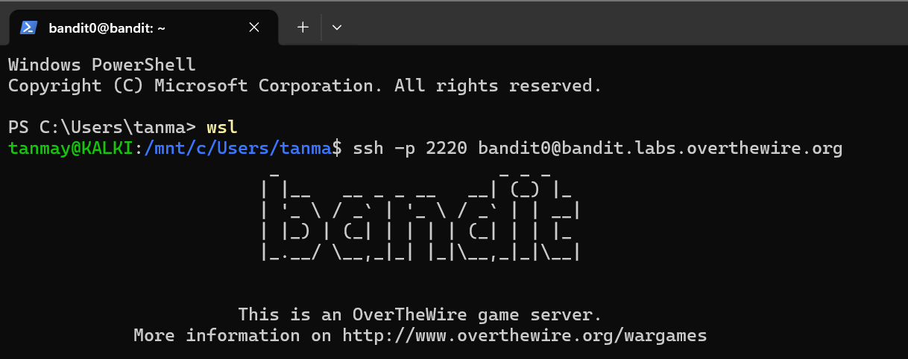
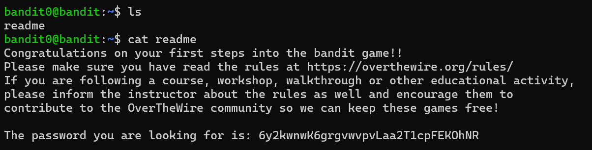

# Bandit Level 0 → 1

## Goal
Level 0 requires connecting to the Bandit server via SSH using the given
credentials, then finding a password hidden in a file in the home directory.

## Concepts / Commands Used
- `ssh` — securely log into a remote host
- `ls` — list files in current directory
- `cat` — print file contents to terminal

## Approach
1. Connected to the Bandit server via SSH on port 2220, using username `bandit0`:
```bash
   ssh -p 2220 bandit0@bandit.labs.overthewire.org
```
2. Accepted the host key fingerprint prompt (first-time connection) by typing `yes`.
3. Logged in using the default password `bandit0` (provided by the Bandit instructions).
4. Ran `ls` to see what was in the home directory → found a file named `readme`.
5. Ran `cat readme` to print its contents → the password for level 1 was inside.

## Command Log
```bash
ssh -p 2220 bandit0@bandit.labs.overthewire.org
ls
cat readme
```

## What I Learned
- SSH host key verification exists to prevent man-in-the-middle attacks — the
  "authenticity of host can't be established" prompt is normal on first connect,
  but should always be checked against a known fingerprint in a real environment,
  not blindly accepted.
- Basic file enumeration (`ls`, `cat`) is often the first step in any Linux-based
  investigation — same muscle memory applies to inspecting logs or config files
  during incident response.

## Password Found
<details><summary>Click to reveal</summary>
6y2kwnwK6grgvwvpvLaa2T1cpFEKOhNR
</details>

## Screenshots

