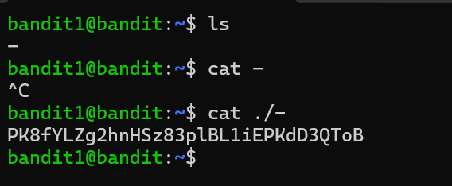

# Bandit Level 1 → 2

## Goal
The password for level 2 is stored in a file called `-` located in the home
directory. Since `-` is a special character in shell commands, it can't be
read directly like a normal filename.

## Commands Used
- `ls` — list files in current directory
- `cat` — print file contents to terminal

## Approach
1. Logged into level 1 using the password obtained from level 0.
2. Ran `ls` to see the home directory contents → found a file literally named `-`.
3. Tried `cat -` directly, which failed — the shell interprets a lone `-` as
   an argument meaning "read from stdin", not as a filename.
4. The fix is to tell `cat` explicitly that `-` is a filename, not a flag, by
   prefixing it with `./` (its relative path) or by using `--` to signal
   "end of options, treat everything after this as a filename."
5. Ran `cat ./-` → successfully printed the password.

## Command Log
```bash
ls
cat ./-
```
(alternative that also works: `cat -- -`)

## Password Found
<details><summary>Click to reveal</summary>
PK8fYLZg2hnHSz83plBL1iEPKdD3QToB
</details>

## Screenshots
