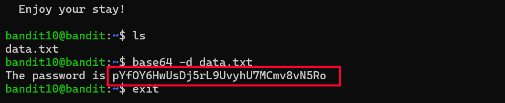

# Bandit Level 10 → 11

## Goal
The password for level 11 is stored in `data.txt`, but the data is
Base64-encoded rather than plain text.

## Commands Used
- `ls` — list files in current directory
- `cat` — viewed the raw file contents
- `base64 -d` — decode Base64-encoded data back into its original form

## Approach
1. Logged into level 10 using the password obtained from level 9.
2. Ran `ls` to confirm the file `data.txt` was present.
3. Ran `cat data.txt` and saw a block of text made up of letters, numbers,
   `+`, `/`, and `=` padding at the end — a clear sign the content was
   Base64-encoded rather than plain or binary data.
4. Used `base64 -d data.txt`, where the `-d` flag tells `base64` to decode
   the input instead of encoding it.
5. The decoded output directly printed a line containing the password.

## Command Log
```bash
ls
cat data.txt
base64 -d data.txt
```

## Password Found
<details><summary>Click to reveal</summary>
pYfOY6HwUsDj5rL9UvyhU7MCmv8vN5Ro
</details>

## Screenshots
