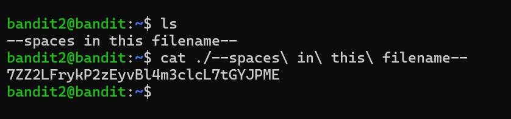

# Bandit Level 2 → 3

## Goal
The password for level 3 is stored in a file called `--spaces in this filename--`
located in the home directory. The filename contains spaces and starts with
dashes, both of which need special handling in the shell.

## Commands Used
- `ls` — list files in current directory
- `cat` — print file contents to terminal

## Approach
1. Logged into level 2 using the password obtained from level 1.
2. Ran `ls` to see the home directory contents → found a file literally named
   `--spaces in this filename--`.
3. Since the filename contains spaces, the shell would normally treat each
   space-separated word as a separate argument. To read it as one filename,
   each space needs to be escaped with a backslash `\`, or the whole name
   could be wrapped in quotes.
4. Also prefixed the filename with `./` so the leading `--` isn't
   misinterpreted as a command flag (same issue as level 1).
5. Ran `cat ./--spaces\ in\ this\ filename--` → successfully printed the password.

## Command Log
```bash
ls
cat ./--spaces\ in\ this\ filename--
```
(alternative that also works: `cat "--spaces in this filename--"`)

## Password Found
<details><summary>Click to reveal</summary>
7ZZ2LFrykP2zEyvBl4m3clcL7tGYJPME
</details>

## Screenshots
