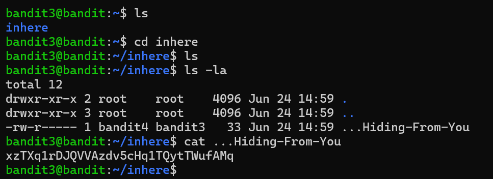

# Bandit Level 3 → 4

## Goal
The password for level 4 is stored in a hidden file inside the `inhere`
directory. Hidden files (starting with `.`) don't show up with a plain `ls`.

## Commands Used
- `ls` — list files in current directory
- `ls -la` — list all files, including hidden ones, with detailed info
- `cat` — print file contents to terminal

## Approach
1. Logged into level 3 using the password obtained from level 2.
2. Navigated into the `inhere` directory.
3. Ran `ls` → showed nothing, meaning the directory looked empty on the surface.
4. Ran `ls -la` to show hidden files (`-a`) along with permissions/details (`-l`)
   → found a file named `...Hiding-From-You`.
5. Ran `cat ...Hiding-From-You` → successfully printed the password.

## Command Log
```bash
ls
ls -la
cat ...Hiding-From-You
```

## Password Found
<details><summary>Click to reveal</summary>
xzTXq1rDJQVVAzdv5cHq1TQytTWufAMq
</details>

## Screenshots
