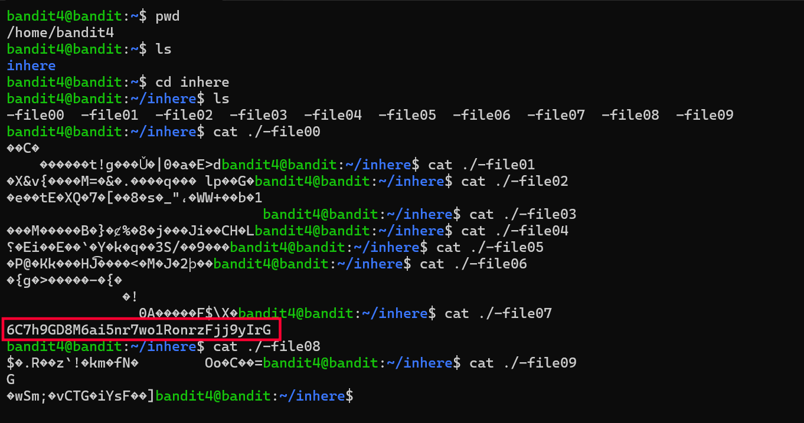

# Bandit Level 4 → 5

## Goal
The password for level 5 is stored in one of ten files (`-file00` to `-file09`)
inside the `inhere` directory. Only one file contains human-readable text —
the rest contain garbage/binary data.

## Commands Used
- `pwd` — print current directory
- `ls` — list files in current directory
- `cat` — print file contents to terminal

## Approach
1. Logged into level 4 using the password obtained from level 3.
2. Ran `pwd` and `ls` to confirm location and found an `inhere` directory.
3. Moved into `inhere` and ran `ls` → found ten files named `-file00` through
   `-file09`, all starting with a dash (so needed `./` prefix to read, same
   issue as earlier levels).
4. Went through each file one by one with `cat ./-file00`, `cat ./-file01`,
   etc. Most files printed unreadable binary/garbage characters.
5. `-file07` printed clean, human-readable text — the password.

## Command Log
```bash
pwd
ls
cd inhere
ls
cat ./-file00
cat ./-file01
cat ./-file02
cat ./-file03
cat ./-file04
cat ./-file05
cat ./-file06
cat ./-file07
cat ./-file08
cat ./-file09
```

## Password Found
<details><summary>Click to reveal</summary>
6C7h9GD8M6ai5nr7wo1RonrzFjj9yIrG
</details>

## Screenshots
