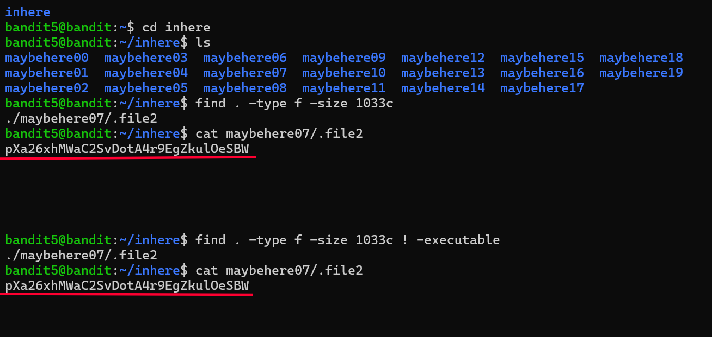

# Bandit Level 5 → 6

## Goal
The password for level 6 is stored in a file inside the `inhere` directory
that meets specific criteria: it's human-readable, exactly 1033 bytes,
and not executable. The directory contains many nested subdirectories with
similarly-named decoy files.

## Commands Used
- `cd` — change directory
- `ls` — list files in current directory
- `find` — search for files matching specific conditions

## Approach
1. Logged into level 5 using the password obtained from level 4.
2. Moved into the `inhere` directory and ran `ls` → found 20 subdirectories
   named `maybehere00` through `maybehere19`, each likely containing decoy files.
3. Manually checking each one would be slow, so used `find` to search by the
   file properties given in the level instructions instead:
   - `-type f` → only regular files (not directories)
   - `-size 1033c` → exactly 1033 bytes in size
4. Ran `find . -type f -size 1033c` → returned one match:
   `./maybehere07/.file2`
5. Ran `cat maybehere07/.file2` → printed the password.
6. To be thorough, re-ran the search adding `! -executable` (matches files
   that are NOT executable) to confirm the same file matched all three
   conditions from the level description, not just the size.

## Command Log
```bash
cd inhere
ls
find . -type f -size 1033c
cat maybehere07/.file2
find . -type f -size 1033c ! -executable
cat maybehere07/.file2
```

## Password Found
<details><summary>Click to reveal</summary>
pXa26xhMWaC2SvDotA4r9EgZkulOeSBW
</details>

## Screenshots
