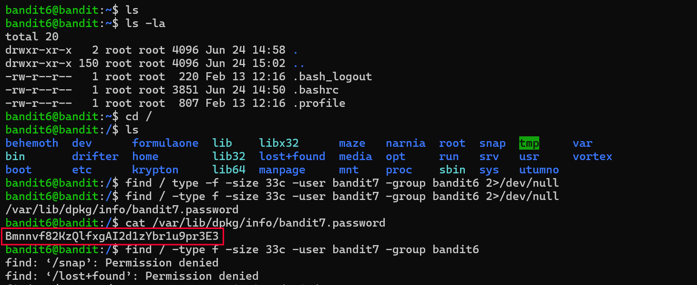

# Bandit Level 6 → 7

## Goal
The password for level 7 is stored in a file somewhere on the entire
filesystem (not just the home directory), owned by user `bandit7`, group
`bandit6`, and exactly 33 bytes in size.

## Commands Used
- `ls` / `ls -la` — list files, including hidden ones
- `cd` — change directory
- `find` — search for files matching specific conditions across the filesystem
- `cat` — print file contents to terminal

## Approach
1. Logged into level 6 using the password obtained from level 5.
2. Checked the home directory with `ls` and `ls -la` → only default hidden
   config files were present, nothing useful.
3. Since the level description said the file could be anywhere on the
   system, moved to the root directory (`cd /`) to search from there.
4. Used `find` with the conditions given in the level description:
   - `-type f` → only regular files
   - `-size 33c` → exactly 33 bytes
   - `-user bandit7` → owned by user bandit7
   - `-group bandit6` → owned by group bandit6
5. Redirected error output (`2>/dev/null`) to suppress "Permission denied"
   messages from directories that couldn't be searched, keeping the output clean.
6. `find` returned one match: `/var/lib/dpkg/info/bandit7.password`
7. Ran `cat` on that file → printed the password.

## Command Log
```bash
ls
ls -la
cd /
ls
find / -type f -size 33c -user bandit7 -group bandit6 2>/dev/null
cat /var/lib/dpkg/info/bandit7.password
```

## Password Found
<details><summary>Click to reveal</summary>
Bmnnvf82KzQlfxgAI2d1zYbr1u9pr3E3
</details>

## Screenshots
