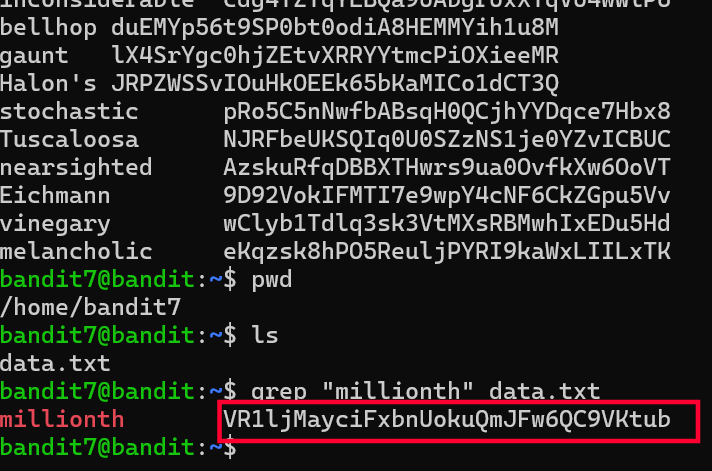

# Bandit Level 7 → 8

## Goal
The password for level 8 is stored in `data.txt`, next to the word
"millionth". The file is large, so the line needs to be found by searching
for that word rather than scrolling through manually.

## Commands Used
- `pwd` — print current directory
- `ls` — list files in current directory
- `grep` — search for a pattern/word inside a file

## Approach
1. Logged into level 7 using the password obtained from level 6.
2. Ran `pwd` and `ls` to confirm location → found a file called `data.txt`.
3. Since the file was too large to read line by line, used `grep` to search
   directly for the keyword "millionth" mentioned in the level description.
4. Ran `grep "millionth" data.txt` → returned the matching line, which
   contained the word "millionth" followed by the password.

## Command Log
```bash
pwd
ls
grep "millionth" data.txt
```

## Password Found
<details><summary>Click to reveal</summary>
VR1ljMayciFxbnUokuQmJFw6QC9VKtub
</details>

## Screenshots



