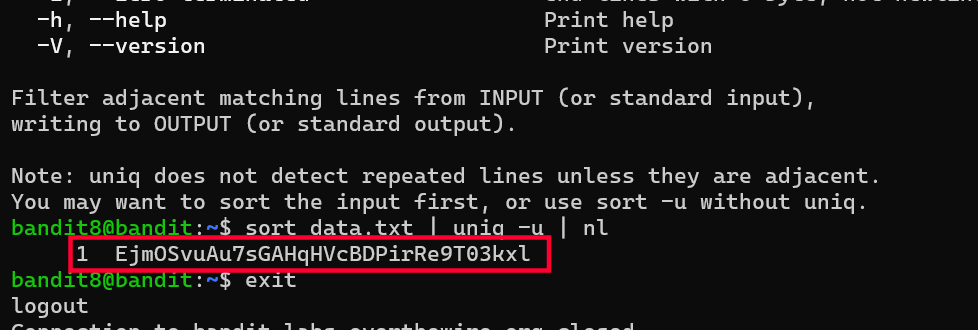

# Bandit Level 8 → 9

## Goal
The password for level 9 is stored in `data.txt` and is the **only line
that occurs exactly once** — every other line in the file is repeated.

## Commands Used
- `sort` — arrange lines alphabetically so identical lines become adjacent
- `uniq` — filter matching lines (only works on lines that are adjacent)
- `nl` — number output lines, used here just to make the result easier to read

## Approach
1. Logged into level 8 using the password obtained from level 7.
2. Checked the home directory → found `data.txt`, a large file with many
   repeated lines and one unique line (the password).
3. `uniq` only removes/filters duplicate lines when they're **adjacent** to
   each other — it doesn't scan the whole file. So running `uniq` directly
   on the unsorted file wouldn't work.
4. First tried `sort -u`, but `-u` on `sort` just sorts and removes
   duplicates in one step, which isn't quite what was needed here — piping
   into `uniq -u` was the correct approach.
5. Used `sort data.txt` to alphabetically order all lines, which places
   every duplicate line next to its copies.
6. Piped that into `uniq -u`, where `-u` tells `uniq` to print only the
   lines that have **no** adjacent duplicates — i.e., the one line that
   appears exactly once.
7. Piped the result into `nl` just to number the output and make it clear/
   easy to read.
8. The single surviving line was the password.

## Command Log
```bash
pwd
ls
sort data.txt | uniq -u | nl
```

## Password Found
<details><summary>Click to reveal</summary>
EjmOSvuAu7sGAHqHVcBDPirRe9T03kxl
</details>

## Screenshots
