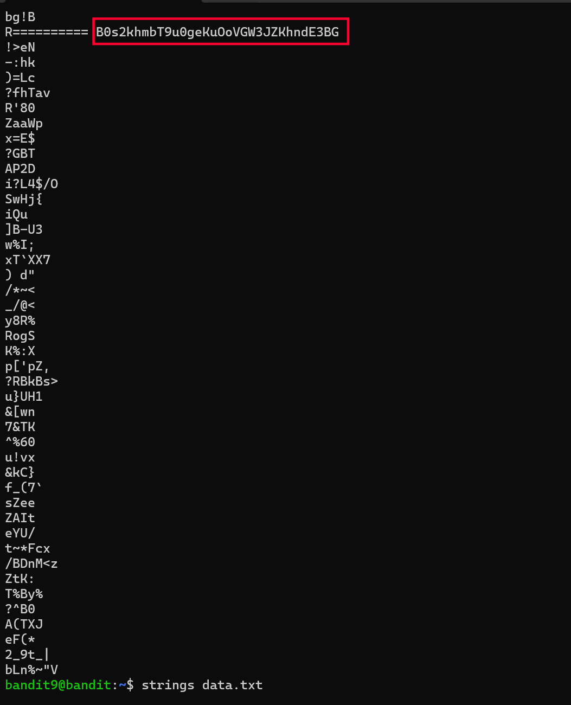

# Bandit Level 9 → 10

## Goal
The password for level 10 is stored in `data.txt`, but the file contains
mostly binary/non-printable data. The password is preceded by several `=`
characters and is the only human-readable text of value in the file.

## Commands Used
- `ls` — list files in current directory
- `cat` — print file contents to terminal
- `strings` — extract human-readable (ASCII) text from a binary/mixed file

## Approach
1. Logged into level 9 using the password obtained from level 8.
2. Ran `ls` to confirm the presence of `data.txt`.
3. Ran `cat data.txt`, but the file was largely binary — the output was
   mostly unreadable garbage characters, not plain text.
4. Since the file mixed binary data with a few readable strings, used
   `strings data.txt` to filter out and print only the printable ASCII
   sequences in the file.
5. Scanned the output for anything that looked like a password — the level
   hint mentioned it would be preceded by several `=` characters, which
   made it easy to spot in the `strings` output.
6. The line following the `=====` marker was the password.

## Command Log
```bash
ls
cat data.txt
strings data.txt
```

## Password Found
<details><summary>Click to reveal</summary>
B0s2khmbT9u0geKuOoVGW3JZKhndE3BG
</details>

## Screenshots
